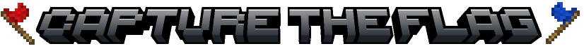

    

<h1 align="center">Map Maker Handbook (WIP 🏗️)</hi>

This is a detailed guide on the process of making a map for the Minetest Capture the Flag game. This is still a work in progress.

* [`mapmaker-setup.md`](https://github.com/CTF-handbooks/map-maker-handbook/blob/main/mapmaker-setup.md#the-map-makers-handbook-wip): The guide on how to setup your game and world for map making. Start reading here!
